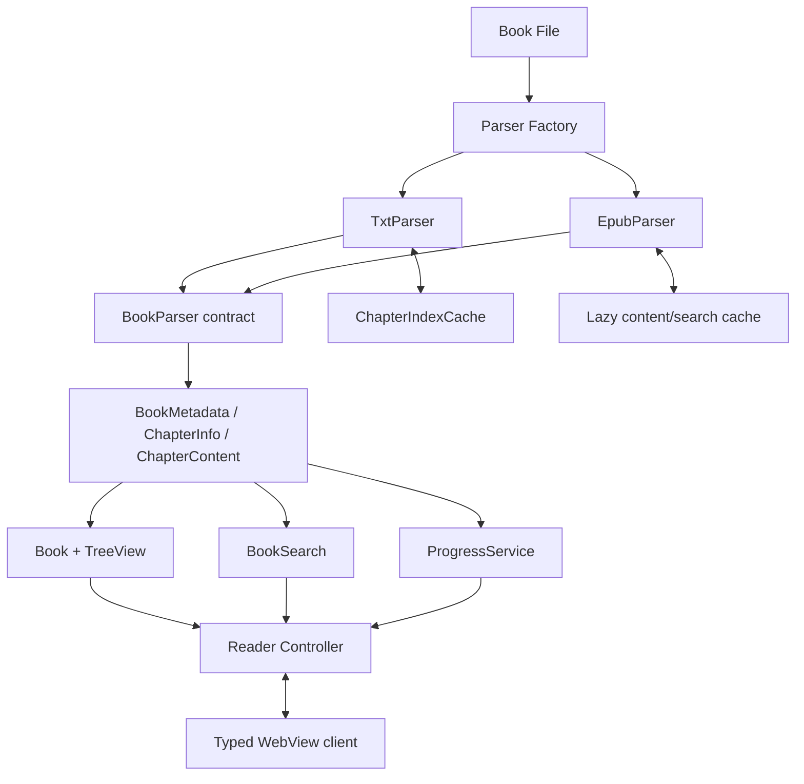

# moyu-novel-ts 开发计划

> 文档状态：执行基线  
> 最后更新：2026-08-13  
> 仓库基线：`main` / `b4ea173` / `package.json` 版本 `2.1.11`  
> 当前进度：仓库静态审计已完成，Phase 0 尚未开始

本文档是 `moyu-novel-ts` 的长期开发基线。需求、优先级或技术决策发生变化时，应先更新本文档，再进入对应实现。

## 1. 产品目标

`moyu-novel-ts` 的目标是成为一个轻量、纯本地、高性能、适合在 VS Code 内阅读中文网络小说的插件。

核心能力：

- 支持 TXT，以及“小说正文模式”的 EPUB 2/3 文本内容。
- 提供稳定的章节、阅读进度、全文搜索和阅读进度条。
- 保留现有快捷键、自动滚屏、已读章节、主题与本地阅读体验。
- 使用 TypeScript、原生 DOM、CSS、VS Code Extension API 和 esbuild。
- 在 MIT License 下继续维护，并保留上游作者版权和 attribution。

成功后的 Reader 只消费统一的 `BookMetadata`、`ChapterInfo`、`ChapterContent`、`ReadingProgress` 和 `SearchResult`，不感知 TXT 与 EPUB 的内部差异。

## 2. 范围边界

### 2.1 必须坚持

- 运行时完全本地处理，不要求账号或网络服务。
- 渐进式重构；每个 Phase 都保持仓库可编译、可测试、可调试。
- TXT 行为先锁定再重构，避免为 EPUB 牺牲已有体验。
- 新增核心逻辑使用 strict-friendly TypeScript，避免 `any` 和不可测试的 God Object。
- 小说原文件只读；缓存统一存放在 Extension global storage。
- 新增依赖必须少、小、成熟，兼容 VS Code Extension Host 与 esbuild，并记录许可证。

### 2.2 明确不做

- 不引入 Vue、React、Angular、Svelte 或大型 UI Framework。
- 不做账号、云书架、网络爬取、在线同步或无必要网络能力。
- 不做 Calibre、Kindle 或完整 EPUB Renderer。
- EPUB 首版不支持 DRM、fixed-layout、出版社 CSS/字体、SVG、音视频、JavaScript、复杂表格、完整脚注交互和高保真排版；图片也不作为首版门槛。
- 不删除整个 `src` 后重写，不机械全局替换 namespace。

“纯本地”约束针对插件运行时，不限制开发期安装依赖、执行 CI 或发布 Marketplace 包。

## 3. 当前仓库基线

### 3.1 已确认状态

- GitHub remote 已指向 `upuphero/moyu-novel-ts`，但扩展清单与 README 仍主要使用上游身份。
- `package.json` 仍为 `name: novel-look-ts`、`displayName: novel-look2`、`publisher: ytx222`；repository、homepage 和 bugs 仍指向上游。
- `LICENSE.txt` 保留了上游 MIT License 和 `Copyright (c) 2020 yangtengxiang`，该声明不得删除或替换。
- 目前只识别 TXT；默认文件规则为 `^.*\.txt$`。
- Extension Host 已迁移到 esbuild，但 WebView 仍是 `static/js/*.js` 原生模块；webpack 配置和依赖仍有历史残留。
- 测试套件只有 VS Code 示例测试，没有业务测试；CHANGELOG 停在 `2.0.3`，低于包版本 `2.1.11`。
- `.nvmrc` 指定 Node.js `16.20.2`；`package-lock.json` 根版本仍为 `2.1.10`，与包版本不一致，且保留历史镜像地址。
- 本轮仅完成静态审计；当前执行环境未提供 Node.js/npm，且仓库没有 `node_modules`，因此编译、lint 和测试基线仍须在 Phase 0 的开发环境检查中补齐。

### 3.2 开工前必须锁定的既有缺陷

以下问题已存在于仓库基线，先建立 characterization/smoke test，再修复；否则后续无法判断是旧缺陷还是重构回归。

| 问题 | 影响 | Phase 0 最低处理 |
| --- | --- | --- |
| `activate()` 未等待异步 `init()` | 命令可能在文件与 TreeView 初始化前被调用 | 改为可等待的激活流程并覆盖激活测试 |
| WebView 静态目录复制不保证创建目标/子目录，写入错误被吞 | 全新 global storage 可能无法打开 Reader | clean-install fixture 能成功创建资源并打开 Reader |
| 只有嵌套目录有书时，根 `bookMap` 为空；嵌套 Book 未进入 map | TreeView 空白、最近章节无法恢复 | 递归建立索引并覆盖仅嵌套书库场景 |
| 文件筛选配置在模块加载时缓存，非法 regex 无保护 | 修改设置后刷新无效，错误规则可令书架失败 | 每次刷新读取有效配置；非法规则提示并回退 |
| context menu 使用错误的 `novelLookTreeViewk` | 章节菜单无法显示 | 修正 contributes 并加入 manifest 断言 |
| WebView 只按章节标题去重 | 不同书或不同章节同名时可能拒绝渲染 | 改用 book/chapter identity 判断 |
| 自动滚屏的 `lastRenderId` 未更新 | 每个滚动 tick 重算尺寸 | 修复并加入滚动性能 smoke test |
| CSP 被注释，消息与主题输入缺少边界校验 | WebView 安全边界较弱 | 在 TS 迁移前先记录风险；Phase 8 完成 CSP 与消息校验 |

工具链整体版本较旧，升级 Node/TypeScript/VS Code engine 必须作为独立变更评审，不能夹带在 Parser 重构中。

### 3.3 当前架构

| 层 | 主要文件 | 当前职责 | 主要问题 |
| --- | --- | --- | --- |
| 激活与装配 | `src/extension.ts`, `src/index.ts` | 初始化上下文、文件模块、TreeView，批量注册命令 | 命令前缀硬编码为 `novel-look.`，含示例命令与调试日志 |
| 配置与状态 | `src/config.ts`, `src/util/util.ts` | 读取 `novelLook.*` 配置，读写 `globalState` | 无 schema/version，无新旧 namespace fallback，状态 key 分散 |
| 书架与模型 | `src/treeView/*.ts` | Book/Chapter/分组、已读状态、上下章切换 | Book、TXT 索引和 UI TreeItem 耦合；已读 key 只使用书名 |
| TXT 解析 | `src/file/*`, `src/split.ts` | 文件遍历、编码识别、单正则分章 | 每次展开都会重新 `split`；`txtIndex/size/substring` 无法复用于 EPUB |
| Reader Host | `src/webView.ts` | WebviewPanel 生命周期、消息转发、像素进度与设置 | 进度只存 pixel；消息类型仍含 `any`；`postMessage` 使用 5ms 竞速绕过 |
| Reader Client | `static/webView.html`, `static/style.css`, `static/js/*.js` | DOM 渲染、主题、键鼠操作、自动滚屏 | JavaScript 缺少类型边界；搜索、语义进度和进度条尚不存在 |
| 构建与测试 | `esbuild.config.js`, `tsconfig.json`, `src/test/*` | 打包 Extension Host、运行 VS Code 测试 | WebView 未进入 TS 构建；无核心单测、无 CI，仍有 webpack 遗留 |

### 3.4 当前数据流

TXT 阅读：

```text
globalStorage 中的小说文件
  -> readBookDirTerr() 递归筛选
  -> Book.getContent() 读取整本并识别编码
  -> split() 用单个用户配置正则扫描全文
  -> Chapter(txtIndex, size)
  -> substring() + 按行清洗
  -> src/webView.ts postMessage(showChapter)
  -> static/js/webView.js 渲染 div 列表
```

TreeView：

```text
activate()
  -> initFile() + createTreeView()
  -> Bookrack(readBookDirTerr(globalStorageUri))
  -> getChildren(Book)
  -> Book.getChapterList()
  -> 每次调用 split(this.txt)
  -> Chapter / ChapterGroup
```

`Book` 会将全文缓存于内存约 10 分钟，但章节列表每次展开仍重新扫描全文。

阅读状态：

| Key / 位置 | 内容 | 已知缺陷 |
| --- | --- | --- |
| `lastOpenChapter` | 标题、章节数组下标、书名、完整路径 | 章节变化后依赖标题和下标猜测恢复 |
| `book_<book label>` | 已读章节数组 | 同名文件冲突，移动或改名无迁移 |
| `saveScroll` | `{ key, value }`，value 为 pixel | 字号、zoom、行高或宽度变化后失真；只保留一个位置 |
| `isShowReadChapter` | 是否显示已读章节 | 未版本化 |
| WebView `vscode.setState()` | 当前章节、设置、pixel | 仅用于面板隐藏后的临时恢复 |
| `novelLook.*` | 文件匹配、章节正则、阅读与主题设置 | 与长期 namespace 不一致，scope 迁移需谨慎 |

WebView 通信目前为：

- Extension Host → WebView：`showChapter`、`readScroll`、`setting`。
- WebView → Extension Host：`chapterToggle`、`zoom`、`updateReadSetting`、`saveScroll`、`toggleZenMode`、`changeUseTheme`。

### 3.5 旧身份与稳定 ID 清单

| 类别 | 当前值 | 长期目标 | 迁移原则 |
| --- | --- | --- | --- |
| 包身份 | `novel-look-ts` / `novel-look2` | `moyu-novel-ts` / `Moyu Novel` | Phase 0 直接更新用户可见身份 |
| 当前仓库 URL | 上游 URL | `https://github.com/upuphero/moyu-novel-ts` | Phase 0 统一；上游 URL 仅留在 Credits |
| Publisher | `ytx222` | 当前维护者的 Marketplace Publisher ID | 未确认前不得冒用或臆造 |
| Command | `novel-look.*` | `moyu-novel.*` | 先增加新 ID 和旧 alias，再迁内部调用 |
| Configuration | `novelLook.*` | `moyuNovel.*` | 新值优先，旧值 fallback；按 scope 迁移 |
| TreeView | `novelLookTreeView` | `moyuNovelTreeView` | 在验证兼容行为后迁移 |
| Activity container | `novel-look` | `moyu-novel` | 与视图迁移一起完成 |
| globalState | `book_*`, `saveScroll`, `lastOpenChapter`, `isShowReadChapter` | 带 schema 的新 key | 只迁一次，验证写入，不抢先删除旧值 |

> **发布阻断风险：** VS Code 扩展 ID 由 `publisher.name` 决定。同时修改 `publisher` 与 `name` 会形成一个新的扩展身份；新扩展通常无法直接读取旧扩展的 `globalState` 与 `globalStorageUri`。当前书库文件本身也存放在 global storage，因此 `migrateLegacyState()` 并不能天然保证老用户的书库与进度可达。Phase 0 必须做真实安装/升级 spike，并在“保持旧扩展 ID”“由旧版导出、新版导入”“明确指导复制旧存储目录”等方案中形成 ADR。验证前不得承诺无损自动迁移或发布改名后的扩展。

## 4. 目标架构



建议目录是迁移方向，不是要求一次性搬迁：

```text
src/
  core/
    book/           # BookMetadata, ChapterInfo, ChapterContent
    parser/         # BookParser, ParserFactory, TxtParser, EpubParser
    progress/       # bookId, ReadingProgress, migration/storage
    cache/          # chapter/search cache schema and validation
    search/         # BookSearch and SearchResult
  treeView/         # VS Code TreeItem adapter
  webview/          # typed DOM reader client
  test/
    fixtures/       # TXT/GBK/EPUB fixtures
```

应保留并覆盖回归测试的能力：编码识别、TreeView 基础交互、已读章节分组、主题思路、自动滚屏、键盘/鼠标操作和现有阅读布局。

应逐步重构的边界：`Book` 中的全文与索引管理、`Chapter` 中的 substring 逻辑、`split.ts` 的单巨型正则、分散的 globalState key、无类型 WebView 消息、像素进度和 WebView 静态 JS 构建。

## 5. 优先级

| 优先级 | 目标 | 完成含义 |
| --- | --- | --- |
| P0 | 身份迁移、Parser 抽象、TXT 不回归 | 项目可独立开发，统一模型落地，现有 TXT 行为受测试保护 |
| P1 | Book ID、语义进度、TXT 章节缓存 | 位置恢复可靠，重复展开不再全文 split |
| P2 | EPUB 小说模式 | reflowable、无 DRM 的文字 EPUB 2/3 可与 TXT 共用 Reader |
| P3 | 全书搜索、阅读进度条 | TXT/EPUB 可搜索、定位并显示章节/全书进度 |
| P4 | 章节识别、Reader UI、WebView TypeScript | 中文小说适配与维护体验完善，旧 namespace 收口 |

## 6. 实施路线

Phase 状态只允许：`未开始`、`进行中`、`阻塞`、`完成`。完成任务或调整范围时同步更新下表和文档顶部日期。

| Phase | 主题 | 依赖 | 状态 |
| --- | --- | --- | --- |
| 0 | 身份、既有缺陷与工程基线 | 无 | 未开始 |
| 1 | 统一 Parser 与 TXT 适配 | Phase 0 | 未开始 |
| 2 | Book ID、状态与语义进度 | Phase 1 | 未开始 |
| 3 | TXT 章节索引缓存 | Phase 1；与 Phase 2 共用 bookId | 未开始 |
| 4 | EPUB 小说模式 | Phase 1、2 | 未开始 |
| 5 | 全书搜索 | Phase 3、4 | 未开始 |
| 6 | 阅读进度条 | Phase 2 | 未开始 |
| 7 | 中文章节识别升级 | Phase 1、3 | 未开始 |
| 8 | Reader UI 与 WebView TypeScript | Phase 2、5、6 | 未开始 |
| 9 | namespace 收口与发布准备 | Phase 0–8 | 未开始 |

### Phase 0：身份与工程基线（P0）

目标：先建立可重复的旧行为基线并修复阻断性既有缺陷，再让 fork 拥有正确、合法、可维护的公开身份，同时冻结兼容方案。

| ID | 任务 | 主要交付物 | 验收 |
| --- | --- | --- | --- |
| P0-01 | 补齐可复现基线 | 记录 Node/npm/VS Code 版本；核对 lockfile；运行 compile、typecheck、lint、test、package | 基线结果有记录，既有失败单独建账，不混入功能改造 |
| P0-02 | 建立回归护栏 | 现有 split/encoding/state shape 的 characterization tests；clean install 与交互 smoke checklist | 不再只有 sample test；可区分旧缺陷与新回归 |
| P0-03 | 修复阻断性既有缺陷 | async activate、dev mode 判断、静态资源初始化、嵌套书库、动态配置、菜单条件、同名章节等 | 全新 global storage 可读；仅嵌套目录也显示；非法 regex 不令书架崩溃 |
| P0-04 | 验证外部扩展身份迁移 | 旧版与新版 VSIX 的同 ID update / 新 ID replacement spike；状态与书库可达性报告 | 在修改发布身份前明确旧书库与状态能否读取；不可达时交付可验证的导出/导入或人工迁移方案 |
| P0-05 | 确认 Publisher 与发布策略 | ADR-001、ADR-002 | 不再冒用 `ytx222`；未确认时明确阻止发布但不阻止 Extension Development Host |
| P0-06 | 迁移用户可见身份 | `package.json`、README、CHANGELOG、欢迎文字、仓库链接 | `name/displayName` 正确；active metadata/homepage/issues 不误指上游；历史/兼容引用受 allowlist 约束 |
| P0-07 | 建立 legacy inventory 与兼容常量 | command/config/view/state/storage 清单、迁移测试矩阵 | 区分扩展 ID 迁移与内部 namespace alias；禁止散落字符串和全局替换 |
| P0-08 | 审计公开配置兼容性 | `titleSize`、`fontWidght`、`fontFamily`、主题空壳等保留/修复/弃用矩阵 | 已贡献 key 不被静默删除；拼写修复有 alias/migration；scope 有记录 |
| P0-09 | 明确平台支持 | Windows/macOS/Linux 支持矩阵、打开目录实现、virtual workspace 结论 | 优先使用 VS Code 跨平台 API；未支持的平台在 README 明示，不再保留错误承诺 |
| P0-10 | 建立最低 WebView 安全边界 | 禁止远程资源、setting/message key 白名单、文本安全渲染 | 任意消息不能更新未允许配置；Reader 正文仍使用 `textContent/innerText` 类安全路径 |
| P0-11 | 清理工程脚手架 | 删除确认无用的 Quickstart、Hello World/test 命令、webpack 遗留和噪声日志 | esbuild 开发/生产构建仍通过；功能命令未被误删 |
| P0-12 | 建立测试/CI 骨架 | `npm ci`、typecheck、快速 unit、VS Code integration、production bundle、VSIX/package smoke 脚本与最小 CI | clean checkout 可重复安装和构建；修复 package/lock 版本漂移并决定历史镜像 URL 的处理 |

Phase gate：身份、许可证和兼容策略通过审查；开发模式和 clean install 均可启动；根目录/嵌套目录书库可用；TXT 烟测、快捷键、自动滚屏和旧状态读取均未回归；旧扩展数据若无法自动访问，发布说明与迁移工具/步骤已经过演练。

### Phase 1：统一 Parser 与 TXT 适配（P0）

目标：切开文件格式、书架模型与 Reader，为 EPUB 留出稳定接口，同时保持 TXT 输出不变。

| ID | 任务 | 主要交付物 | 验收 |
| --- | --- | --- | --- |
| P1-01 | 定义统一模型 | `BookMetadata`, `ChapterInfo`, `ChapterBlock`, `ChapterContent`；头部/preface 语义 | 模型不含 TXT 专属字段；无 `any`；无章节/空书行为明确 |
| P1-02 | 定义 Parser 生命周期 | `BookParser` 与 `ParserFactory` | `.txt` 大小写安全识别；不支持格式返回明确错误 |
| P1-03 | 抽取 `TxtParser` | 读取、编码、分章、按章取内容 | UTF-8/GBK fixtures 通过；章节标题和正文与旧实现等价 |
| P1-04 | 适配 Book/Chapter/TreeView | UI adapter 只消费统一模型 | `Book` 不再直接管理 `txtIndex/size/substring` |
| P1-05 | 锁定 TXT 回归 | parser、TreeView 与 Reader adapter 测试 | 头部、空行、重复章名、无章节文件、已读分组均有覆盖 |

Phase gate：TXT 数据经过新接口进入现有 Reader；对用户可见的 TXT 阅读、切章、已读状态和自动滚屏行为不变。

### Phase 2：Book ID、状态与语义阅读进度（P1）

目标：从“书名 + 章节下标 + pixel”迁移到带版本的稳定状态。

| ID | 任务 | 主要交付物 | 验收 |
| --- | --- | --- | --- |
| P2-01 | 定义 `bookId` 与 `chapterId` | ID 生成器、碰撞与移动策略测试 | 同名不同路径不共享状态；算法版本化 |
| P2-02 | 建立带 schema 的状态服务 | typed storage、key 常量、migration marker | 状态读写可测，迁移重复执行幂等 |
| P2-03 | 实现 `ReadingProgress` | `chapterId`, `paragraphIndex`, `paragraphProgress?`, `chapterProgress`, `updatedAt` | 新进度不依赖 pixel 作为主锚点 |
| P2-04 | 实现定位与恢复 | DOM 段落标识、fallback 链 | 改字号、zoom、行高、窗口宽度后恢复到原段落或相邻一段 |
| P2-05 | 迁移旧状态 | `saveScroll`, `lastOpenChapter`, `book_*`, `isShowReadChapter` 兼容 | 旧 pixel 只用于首次恢复并转写新进度；旧值暂不破坏性删除 |

恢复顺序固定为：`chapterId + paragraphIndex` → `chapterProgress` → 章节开头。配置按“新 key 显式值 → 旧 key 显式值 → 新默认值”读取，自动写入前必须尊重 Global、Workspace 和 Workspace Folder scope。

Phase gate：按 Phase 0 选定且演练过的迁移路径，旧安装数据能够恢复或得到明确的人工迁移结果；布局变化后定位误差不超过一个段落；迁移测试覆盖首次、重复和部分失败场景；含本地路径的状态不再跨设备同步。

### Phase 3：TXT 章节索引缓存（P1）

目标：有效缓存命中时，展开书籍和常规 UI 刷新不再扫描整本 TXT。

| ID | 任务 | 主要交付物 | 验收 |
| --- | --- | --- | --- |
| P3-01 | 定义缓存 schema | `TxtChapterIndex`、schema/parser version、原子写入策略 | JSON 损坏或写入中断能安全重建 |
| P3-02 | 实现缓存校验 | size、mtime、规则 hash、parser/schema version | 任一条件变化会重建；未变化直接命中 |
| P3-03 | 接入 `TxtParser` | global storage 下按 `bookId` 隔离的 index | 不修改小说文件或小说所在目录 |
| P3-04 | 增加可观测性与性能测试 | split 调用计数、小型 fixture、固定 seed 的 1/10/30 MB 合成数据生成器 | 第二次展开、收起、切章、重开 Reader、切换已读和普通刷新均为 0 次全文 split |
| P3-05 | 管理缓存生命周期 | 容量、孤儿、版本升级清理策略 | 清理可控且不在每次启动清空全部缓存 |

Phase gate：性能通过行为计数而非只看墙钟时间；文件和用户章节规则变化后的章节结果正确。

### Phase 4：EPUB 小说模式（P2）

目标：支持 reflowable、无 DRM、以文字为主的 EPUB 2/3 子集，并保持 lazy loading。

| ID | 任务 | 主要交付物 | 验收 |
| --- | --- | --- | --- |
| P4-01 | 依赖与安全评审 | ZIP/XML 依赖 ADR、许可证与 bundle 体积记录 | 只引入必要能力；不引入完整 EPUB 引擎 |
| P4-02 | 解析容器与包信息 | ZIP directory、`container.xml`、OPF metadata/manifest/spine | 最小 EPUB 2/3 fixtures 的 title/author/id/spine 正确 |
| P4-03 | 建立懒加载章节表 | spine → `ChapterInfo[]`，标题来源优先级 | 书架加载不得读取全部 XHTML 正文 |
| P4-04 | 提取小说正文 | XHTML → heading/paragraph blocks | `h1/h2/h3/p/div/br` 的顺序和文本正确；不执行脚本、不套用出版社 CSS |
| P4-05 | 接入书架与 Reader | `.epub`/`.EPUB` 识别、ParserFactory、统一 Reader | TXT 与 EPUB 使用同一 Reader 消息模型 |
| P4-06 | 防御恶意输入 | ZIP 条目/解压大小限制、路径规范化、禁用外部实体、内容错误隔离 | ZIP bomb、路径穿越、XXE 和损坏章节不会导致任意文件访问或扩展崩溃 |

Phase gate：2–3 章最小 EPUB 2/3 fixtures、缺失可选 metadata、损坏章节和大小写扩展名测试通过；书架阶段通过 spy 证明未读取章节正文。

### Phase 5：全书搜索（P3）

目标：提供 `Moyu Novel: Search in Book`，返回可跳转、可高亮的章节级结果。

| ID | 任务 | 主要交付物 | 验收 |
| --- | --- | --- | --- |
| P5-01 | 定义搜索 contract | `BookSearch`, `SearchQuery`, `SearchResult` | 结果含 chapterId/index/title、paragraphIndex 和 preview |
| P5-02 | 实现 TXT 搜索 | 复用 chapter index 与文本内容 | 关键词结果归属章节正确，点击后定位并高亮 |
| P5-03 | 实现 EPUB 搜索索引 | 按 spine 懒解析、可取消的索引构建 | 同一有效索引第二次搜索不重新解析全部 XHTML |
| P5-04 | 增加命令与 Reader UI | `moyu-novel.searchBook`、对应 activation event、搜索面板/结果列表 | 兼容当前 VS Code engine；Enter 或明确提交才执行重扫描；不逐键扫描大文件 |
| P5-05 | 缓存与边界策略 | 规则版本、容量、失效、结果上限、取消与错误提示 | 文件或抽取规则变化后失效；大书搜索不阻塞无限增长 |

Phase gate：TXT/EPUB 关键词、无结果、多结果、取消、特殊字符、preview 和段落跳转测试通过。

### Phase 6：阅读进度条（P3）

目标：在 Reader 底部实时、低成本展示阅读位置。

| ID | 任务 | 主要交付物 | 验收 |
| --- | --- | --- | --- |
| P6-01 | 进度计算 | 当前章、总章数、本章百分比、全书百分比 | 基础公式为 `(chapterIndex + chapterProgress) / totalChapterCount`；头部计数遵循 ADR，空书不除零 |
| P6-02 | 轻量 UI | `第 x / y 章`、本章 `%`、全书 `%` | 滚动和切章实时更新，窄窗口不遮挡正文 |
| P6-03 | 控制滚动成本 | rAF/debounce + cached offsets、binary search 或 IntersectionObserver | 每次 scroll 不遍历全部段落，最多每动画帧更新一次 UI/状态 |
| P6-04 | 可选跳转 | 仅在复杂度低时加入 click/drag | 不得为拖动引入大型状态或 UI 依赖；非首版门槛 |

Phase gate：首章/末章、空章、单章、resize、zoom 与自动滚屏场景计算正确，无明显滚动卡顿。

### Phase 7：中文章节识别升级（P4）

目标：以多个可维护 matcher 替换继续扩张的单一巨型正则。

| ID | 任务 | 主要交付物 | 验收 |
| --- | --- | --- | --- |
| P7-01 | 设计 matcher pipeline | `matchChapterTitle()`、分组的 `chapterMatchers` | 匹配器职责清晰，可单独测试和版本化 |
| P7-02 | 扩展规则 | 中文/大写数字、阿拉伯数字、卷部篇节、序尾后记、番外、英文 Chapter | 需求正例全部识别，正文句子/对话反例不识别 |
| P7-03 | 保留自定义规则 | `moyuNovel.match.chapterName` + legacy fallback | 用户显式规则优先；无效 regex 有提示并安全回退 |
| P7-04 | 联动缓存版本 | parser version 与 rule hash | 内置或用户规则变化后索引自动失效 |

Phase gate：正例至少覆盖需求列出的 17 种标题，反例至少覆盖 3 种正文语句；30 MB fixture 无灾难性回溯。

### Phase 8：Reader UI 与 WebView TypeScript（P4）

目标：在不改变 VS Code 风格的前提下改善阅读体验，并建立有类型的前后端边界。

| ID | 任务 | 主要交付物 | 验收 |
| --- | --- | --- | --- |
| P8-01 | 建立 WebView TS 入口 | `src/webview/main.ts` 与共享 message contract | esbuild 同时产出 Extension Host 和 WebView bundle |
| P8-02 | 渐进迁移模块 | reader/dom/scroll/keyboard/search/progress/theme/vscodeApi | 业务 JS 全部进入 TS 检查；不要求把纯静态第三方代码强行改写 |
| P8-03 | 改善布局 | 正文最大宽度、行高、字号、段距、标题、工具栏、hover、responsive | 正文优先，搜索与进度不抢占阅读空间 |
| P8-04 | 修复消息协议 | request/response ID 或无需等待的单向消息 | 移除 `Promise.race(..., sleep(5))` 临时绕过，消息错误可诊断 |
| P8-05 | 加固 WebView 安全边界 | nonce/CSP、主题 DOM/CSS 安全渲染、双向消息 runtime validation | 无远程/非授权脚本；不用不可信 `innerHTML`；payload 与 `updateReadSetting` key 均校验 |
| P8-06 | 完整交互回归 | 自动滚屏、键鼠、主题、禅模式、resize | 全部现有交互矩阵通过，无框架依赖 |

Phase gate：`static/js` 不再承载未类型检查的自有业务逻辑；生产包 CSP、资源 URI 和 WebView 恢复行为通过测试。

### Phase 9：内部 namespace 收口与发布准备（P4）

目标：新代码只使用新 ID，旧 ID 通过明确兼容层继续工作。

| ID | 任务 | 主要交付物 | 验收 |
| --- | --- | --- | --- |
| P9-01 | 迁移并收口剩余 command/view/config ID | 除 Phase 5 已新增搜索命令外的 `moyu-novel.*`, `moyuNovel.*`, `moyuNovelTreeView` | package contributes、activation event、菜单、keybinding、when clause 和内部调用一致 |
| P9-02 | 保留旧 command alias | 集中 legacy adapter 与 deprecation 文档 | 旧 Alt+S/Alt+D 和外部 command 调用仍有效 |
| P9-03 | 完成设置/状态迁移 | migration version、scope-aware fallback、验证与日志 | 老用户的设置、已读、最近章节和进度尽量保留；迁移幂等 |
| P9-04 | 发布文档与检查 | README、CHANGELOG、Credits、已知限制、发布 checklist | MIT 和 attribution 保留；仓库 URL 正确；没有冒用 publisher |
| P9-05 | 定义兼容窗口 | alias/legacy key 的最短保留版本与删除条件 | 未达到窗口前不得移除 legacy 支持 |

Phase gate：active metadata/homepage/issues 不再指向上游；旧身份只存在于 Credits、License、历史 CHANGELOG、迁移代码、legacy 测试和兼容文档；新安装与 Phase 0 选定的旧版本迁移路径都通过验收。

## 7. 全局完成定义

每个 Phase 合并前都必须满足：

1. Phase 0 统一定义的 install、compile、typecheck、lint、unit、integration、production bundle 和适用 VSIX/package smoke 脚本通过。
2. 没有新增 TypeScript error、未解释的 lint disable 或无边界 `any`。
3. TXT 基础回归通过：UTF-8、GBK、分章、切章、已读章节、最近阅读恢复。
4. Alt+S、Alt+D、Space、W/A/S/D、方向键、鼠标侧键、Ctrl+滚轮全部通过手工或自动化检查。
5. 双击自动滚屏、章末自动下一章及跨章进度保存通过检查。
6. 记录修改文件、新增依赖、缓存/schema 变化、迁移影响、性能结果和已知问题。
7. README/CHANGELOG/本计划随用户可见行为或里程碑状态同步更新。
8. 不提交真实小说、用户路径、global storage 或其他个人数据。

## 8. 测试矩阵

| 范围 | 最低覆盖 |
| --- | --- |
| TXT parser | UTF-8、GBK、BOM/无 BOM、无章节、头部、重复标题、自定义 regex；固定 seed 的 1/10/30 MB 合成数据 |
| Chapter matcher | 全部标题正例、正文/对话反例、无效用户 regex、回溯性能 |
| Chapter cache | 命中、缺失、size/mtime/rule/parser/schema 失效、损坏 JSON、写入中断、孤儿清理 |
| EPUB parser | EPUB 2/3 最小 fixture、container/OPF/manifest/spine、标题来源、XHTML blocks、损坏/缺失项、安全限制 |
| Progress | 保存、恢复、切章、resize/zoom/字体变化、段落缺失 fallback、旧 pixel/状态幂等迁移 |
| Search | TXT/EPUB、preview、章节归属、段落位置、高亮、取消、重复搜索缓存、索引失效 |
| Rename | 新旧 command、keybinding、TreeView、配置 scope、状态迁移、新安装与升级 |
| Reader | 键盘、鼠标、自动滚屏、主题、禅模式、panel hide/reveal/dispose、CSP 与资源路径 |

纯 parser/cache/search/progress 测试应尽量脱离 VS Code Extension Host，以获得快速稳定的单元测试；只把真实 API 生命周期与 contributes 行为留给集成测试。小型、无版权问题的 TXT/GBK/EPUB fixtures 可以提交；10/30 MB 文件由固定 seed 的生成器写入临时目录，不提交真实小说或大文件。benchmark 记录机器、Node/VS Code 版本和冷/暖缓存条件；split/XHTML 读取次数是硬指标，墙钟时间作为趋势指标。

## 9. 设计决策门（ADR）

下列问题必须在对应 Phase 开始前形成简短决策记录；未关闭时不得用临时代码固化行为。

| ADR | 最晚阶段 | 待决定内容 |
| --- | --- | --- |
| ADR-001 | Phase 0 | Marketplace Publisher ID、版本与发布策略 |
| ADR-002 | Phase 0 | 外部扩展 ID 改名后旧 `globalState`/`globalStorageUri` 的可达性与书库迁移路径 |
| ADR-003 | Phase 0 | command/config/view 的迁移顺序、alias 保留窗口 |
| ADR-004 | Phase 0 | Windows/macOS/Linux 与 virtual workspace 的支持边界 |
| ADR-005 | Phase 1 | `BookParser.load()` 生命周期、错误和资源释放语义 |
| ADR-006 | Phase 1 | `头部`/preface 的 chapterId、显示与计数语义；无章节/空书行为 |
| ADR-007 | Phase 2 | 路径稳定性与同文件识别的 `bookId` 取舍；文件移动后的行为 |
| ADR-008 | Phase 2 | paragraph 定义、heading 是否占索引、正文变化后的 fallback |
| ADR-009 | Phase 3 | cache schema、原子写入、容量/LRU/孤儿清理和同 size/mtime 内容变化策略 |
| ADR-010 | Phase 4 | ZIP/XML 依赖、支持的 EPUB 子集、标题来源优先级和安全限制 |
| ADR-011 | Phase 5 | 搜索规范化、大小写、结果上限、取消、持久缓存与失效策略 |
| ADR-012 | Phase 7 | 自定义 regex 是完全替换内置规则，还是优先匹配后允许 fallback |

默认安全倾向：配置采用只读 fallback 优先于跨 scope 自动覆盖；旧状态迁移成功后保留旧值一个兼容窗口；缓存损坏时丢弃并重建，不影响小说原文件。

## 10. 预计文件与依赖变化

预计新增：

- `src/core/book/*`
- `src/core/parser/*`
- `src/core/progress/*`
- `src/core/cache/*`
- `src/core/search/*`
- `src/migration/*`
- `src/webview/*`
- parser/progress/search/migration 单元测试与 TXT/EPUB fixtures
- 必要的 ADR 或等价决策记录

预计修改：

- `package.json`, `package-lock.json`
- `README.md`, `CHANGELOG.md`, `LICENSE.txt`（只核对，不删除原声明）
- `src/extension.ts`, `src/index.ts`, `src/config.ts`, `src/webView.ts`
- `src/file/*`, `src/treeView/*`, `src/split.ts`
- `static/webView.html`, `static/style.css`, `static/js/*`
- `esbuild.config.js`, `tsconfig.json`, 测试脚本与 CI 配置

预计依赖能力：

- 一个 ZIP reader，用于按条目读取 EPUB，不在书架阶段整体解压正文。
- 一个安全的 XML parser，用于 container/OPF/XHTML 的非执行式解析。
- 如现有 DOM 能力不足，可评审一个小型 HTML/XML 文本抽取依赖，但不得引入完整 EPUB renderer。

具体包名和版本不在计划阶段预设；Phase 4 必须先比较 bundle 大小、维护状态、Node/VS Code 兼容性、许可证及已知安全问题，再写入 ADR-010 和 lockfile。

## 11. 风险与控制

| 风险 | 影响 | 控制措施 |
| --- | --- | --- |
| 改名形成新的外部 Extension ID | 新扩展无法直接访问旧 globalState/globalStorage 书库 | Phase 0 用两份 VSIX 实测；改名发布前交付导出/导入、复制方案或保留身份的明确决策 |
| 内部 namespace 改名 | 命令、TreeView、设置或状态丢失 | 用户可见身份与稳定 ID 分阶段迁移；集中 alias/fallback；新装与迁移双路径测试 |
| Parser 抽象改变 TXT 输出 | 已有阅读体验回归 | 先建立 golden fixtures 和 adapter，再替换 `Book/Chapter` 内部实现 |
| bookId 取舍不当 | 同名冲突或移动后丢进度 | 算法版本化；迁移映射；ADR 明确“稳定”边界 |
| 缓存误命中或损坏 | 章节错位、无法打开 | 多维 validation、原子写入、校验失败即重建、永不修改原书 |
| EPUB 恶意或超大输入 | 内存/CPU 耗尽或路径攻击 | 条目/解压上限、路径规范化、禁外部实体、逐章 lazy loading、可取消操作 |
| 搜索索引膨胀 | global storage 失控 | 版本化、容量上限、LRU/孤儿回收、按书失效 |
| 语义段落漂移 | 恢复位置不准确 | paragraphIndex + chapterProgress fallback，抽取规则版本化 |
| WebView TS 迁移回归 | 键鼠与自动滚屏失效 | 分模块迁移；每步运行固定交互矩阵；不同时重写 UI 与滚动算法 |
| 旧工具链与运行时较老 | 新依赖或语法不兼容 | Phase 0 冻结版本矩阵；升级 engine/TS 单独决策，不夹带在功能 Phase |

## 12. 长期维护规则

- 一个 Phase 可以拆成多个小 PR/提交，但不得跨过未满足的 phase gate。
- schema、parser rule、search extraction 或 ID 算法变化必须提升版本并提供失效/迁移路径。
- 新功能默认不增加运行时网络请求；若确有需要，必须单独讨论并更新产品边界。
- 每次发布保留 MIT License 与上游 attribution，并检查当前仓库 URL、publisher 和 CHANGELOG。
- 每次性能优化同时记录可重复的 fixture、调用次数或 benchmark，避免只凭主观感觉验收。
- 兼容 alias 和 legacy key 只能在文档化窗口结束、迁移数据充分且升级测试通过后删除。
- 未列入 P0–P4 的想法进入 backlog，不得阻塞当前核心路线；阅读统计、完整主题编辑器和字体推荐目前均属于 backlog。

## 13. 最终发布验收清单

### 项目身份与兼容

- [ ] 当前仓库、homepage、bugs 使用 `upuphero/moyu-novel-ts`。
- [ ] package name、displayName、Publisher 策略正确。
- [ ] MIT License 与原作者 attribution 保留。
- [ ] 新 namespace 生效，旧 command/config/state 兼容策略经过升级测试。

### TXT 与缓存

- [ ] UTF-8、GBK、内置/自定义章节规则正常。
- [ ] 有效缓存命中时，第二次展开和普通 UI 操作为 0 次全文 split。
- [ ] 文件、规则、parser 或 schema 变化会正确失效。

### EPUB

- [ ] `.epub`/`.EPUB` 出现在书架。
- [ ] metadata、manifest、spine、章节顺序和小说正文正确。
- [ ] 书架阶段不读取全部 XHTML；TXT/EPUB 共用 Reader。
- [ ] 不执行 EPUB 脚本、不加载远程资源、不依赖出版社 CSS。

### Progress、Search 与 UI

- [ ] 进度保存 chapterId 与 paragraphIndex，不再只依赖 pixel。
- [ ] 字号/zoom/窗口变化后恢复到原段落或相邻一段，旧 `saveScroll` 可迁移。
- [ ] TXT/EPUB 全书搜索有 preview，可跳章节、跳段落并高亮。
- [ ] Reader 显示第 x/y 章、本章 %、全书 %，滚动更新无全 DOM 扫描。
- [ ] Reader 布局轻量、responsive，WebView 自有业务逻辑进入 TypeScript 构建。

### 交互与质量

- [ ] Alt+S、Alt+D、Space、W/A/S/D、方向键、鼠标侧键、Ctrl+滚轮正常。
- [ ] 双击自动滚屏、章末自动下一章、主题、禅模式和已读章节正常。
- [ ] compile、typecheck、lint、单元测试和集成测试全部通过。
- [ ] 1/10/30 MB TXT 与最小 EPUB 2/3 fixtures 通过性能和功能验收。
- [ ] 运行时无不必要网络能力，无大型前端框架或完整 EPUB 引擎。
